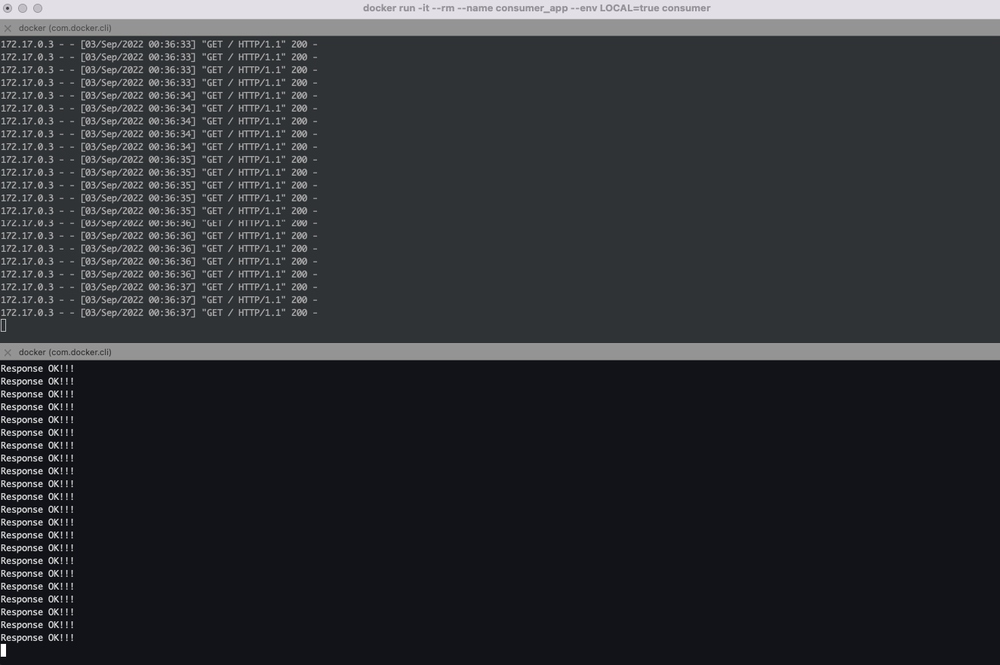

# Challenge-flask-k8s

Este ejemplo crea una API basica de `flask`, con un consumidor que accede desde el service a la API. 
Para exponer la API se creó un servicio tipo NodePort el cual expone un puerto en todos los nodos para que la API sea accesible desde fuera del cluster y por el consumer desde el nodo.

**Requisitos**

- Cluster de k8s (EKS)
- Docker
- kubectl

**Desafío**

- Construir Dockerfile
- Build  de las imagenes del API y el Consumer
- Subir a Docker-hub
- Crear los manifiestos
- Deployments y aplicarlos en el cluster eks
- Service de tipo Nodeport

**Resultados**

### ------------------

⌨️ con ❤️ por [roxsross](https://github.com/roxsross) 😊

No olvides revisar mi blog [roxsross](https://blog.295devops.com) 😊

y mi linktree [roxsross](https://roxs.295devops.com) 😊

"No se trata de cambiar el mundo, creo que creas un cambio pequeño, pero que te importe estás cambiando las cosas".

